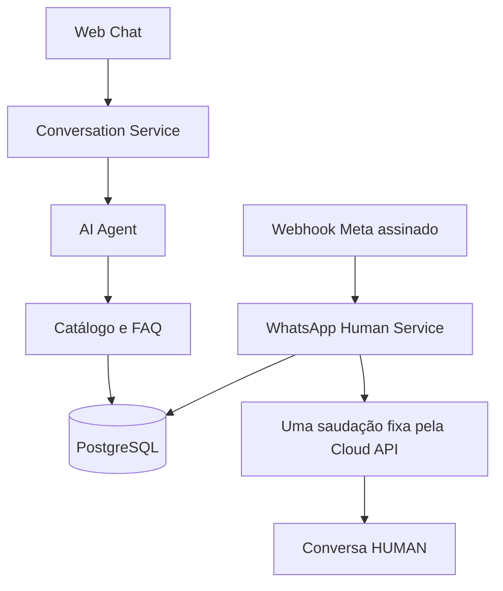

# Atendimento Dark District: IA no site, humano no WhatsApp

O projeto mantém clientes, identidades, conversas e mensagens no PostgreSQL, com
fluxos distintos por canal. O **Web Chat usa o AI Agent normalmente**. O **WhatsApp
é humano**, com uma única saudação automática fixa enviada pelo processo da API.



## Site: arquitetura preservada

- Sessões web usam token aleatório; só o hash fica no banco. O navegador mantém
  a credencial em `sessionStorage`. Não há união automática com a identidade WhatsApp.
- O agente recebe histórico e contexto limitados e escolhe consultas permitidas.
  Preços, estoque e políticas vêm do catálogo/FAQ, não de texto livre inventado.
- As ferramentas permitidas continuam sendo `buscar_produto`, `listar_produtos`,
  `consultar_estoque`, `consultar_preco`, `buscar_por_categoria`, `buscar_por_tamanho`,
  `buscar_por_cor` e `consultar_faq`.
- Saudações, FAQ, abreviações, sugestões de escrita e refinamentos locais funcionam
  sem LLM. `LLM_PROVIDER=openai_compatible` mantém planejamento de consultas mais
  complexas com o provider atual. Não altere essas credenciais para desativar IA
  no WhatsApp: o isolamento agora é feito no código do canal.
- Leases e IDs de mensagem protegem o processamento do Web Chat. Pedir atendente
  leva a WAITING_HUMAN; a equipe pode colocar HUMAN ou retomar AI no canal web.
  Uma resposta atrasada é descartada se o atendimento mudou durante a geração.
- Veja [interação e sugestões](agente-interacao.md), [FAQ](faq.md) e [frete](frete.md).

| Endpoint | Uso |
| --- | --- |
| `POST /api/chat/sessions` | cria sessão web |
| `POST /api/chat/messages` | mensagem com Bearer da sessão e UUID de idempotência |
| `GET /api/chat/messages` | histórico da sessão |
| `DELETE /api/chat/session` | revoga e exclui a sessão |
| `GET /admin/conversations` | consulta administrativa das conversas |
| `GET /admin/conversations/{id}/messages` | histórico administrativo |
| `PATCH /admin/conversations/{id}` | altera status; WhatsApp aceita somente HUMAN |

## WhatsApp: uma saudação, depois humano

`routers/whatsapp.py` mantém validação GET e HMAC-SHA256, confere WABA/número e
filtra mensagens próprias, ecos e status. Depois chama `whatsapp_human_service`:
persiste a mensagem, coloca a conversa em HUMAN, reserva a saudação inicial e
envia pela Cloud API após o commit. Mensagens seguintes são apenas armazenadas.
O canal não chama `conversation_service.receive`, ferramentas, LLM ou AI Agent.

Uma Message de automação registra o resultado do envio (`sent`, `failed`,
`uncertain`, `sending` ou `cancelled`), sem criar uma fila nova de DeliveryJob.
Reserva persistente e IDs únicos impedem que eventos duplicados gerem outra
saudação. Falhas da Meta não apagam a entrada e não causam retries automáticos.

O texto exato, variáveis Meta, validação operacional e limitações estão no
[guia atual do Render](render-whatsapp-worker.md). O nome histórico do arquivo
foi preservado para os links existentes; **não exige Background Worker**.

Conversas antigas com histórico não recebem outra saudação. Ao chegar uma nova
mensagem, tornam-se HUMAN e jobs antigos pendentes da identidade são cancelados.
Pare qualquer processo antigo de worker antes de publicar a mudança. Não é
possível desfazer uma requisição que já tenha sido enviada à Meta.

## Banco e execução

`core.config.Settings` lê as variáveis de ambiente, com precedência sobre
`backend/.env`. `DATABASE_URL` e `SECRET_KEY` continuam obrigatórias. Preserve o
PostgreSQL existente, as credenciais de IA do Web Chat e as demais configurações
do catálogo, CORS e frete. `backend/.env.example` lista valores sem segredos.

No diretório `backend`, para uma instalação configurada:

```sh
python -m pip install -r requirements-dev.txt
python -m alembic upgrade head
python -m uvicorn main:app --host 127.0.0.1 --port 8000 --log-config logging.json
```

As tabelas de atendimento vêm da migration `c94e123a6d53`, após `b83d012f5c42`.
Esta mudança de fluxo não requer nova migration. Não são criadas tabelas ou
usuários administrativos automaticamente no startup. `compose.yaml` continua
sendo uma opção de PostgreSQL local, independente do banco de produção.

Na raiz, o frontend pode ser servido com:

```powershell
backend/venv/Scripts/python.exe -m http.server 5500 --directory frontend
```

No Render, mantenha somente o Web Service existente, com Root Directory `backend`.
Não inicie um worker para atendimento. O arquivo `worker.py` permanece disponível:
`python -m worker`/`--once` não consomem a fila legada; `--purge-expired` mantém a
limpeza explícita de sessões e conversas fora do prazo de retenção.

## Limites e verificação

O atendimento WhatsApp aceita texto; mídia, áudio, campanhas, templates e
conciliação de recibos não foram implementados. HUMAN registra o estado, mas não
cria um painel de atendimento nem notifica automaticamente um atendente. A resposta
manual deve ser feita por uma ferramenta humana conectada ao número oficial.

Os testes usam banco isolado e integrações simuladas. A suíte web protege a IA
existente; a suíte WhatsApp garante a saudação única, persistência, HMAC, ausência
de IA e proteção contra ecos. Testes opcionais PostgreSQL usam exclusivamente
`TEST_POSTGRES_URL`, para validar concorrência em homologação. Nenhum teste faz
envios reais, deploy ou chamadas ao provider.
