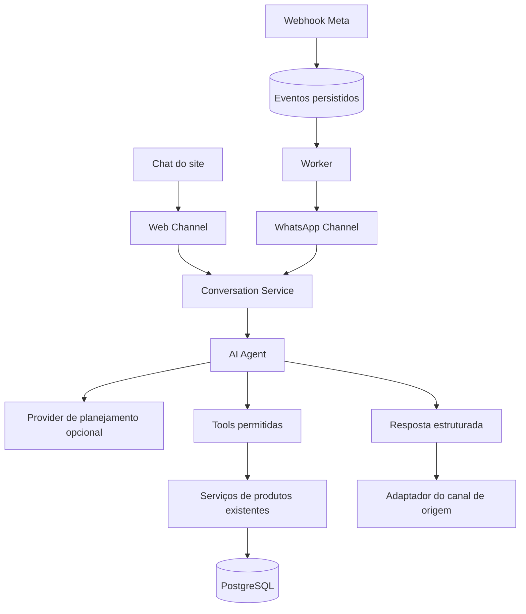

# Atendimento multicanal Dark District — MVP

O site e o WhatsApp usam o mesmo agente, catálogo, ferramentas e banco. A camada
do modelo escolhe consultas permitidas; os fatos comerciais são montados no
backend a partir dos produtos reais e do FAQ publicado. O frontend continua HTML/CSS/ES Modules.

## Decisões e reaproveitamento

As melhorias posteriores de diálogo, correção de digitação e respostas sugeridas
estão descritas em [conversa e sugestões de escrita](agente-interacao.md).

- Mantidos `database.py`, autenticação administrativa, modelos de produtos,
  categorias/coleções, serviços existentes, URLs públicas e carrinho.
- `services/produtos.py` ganhou filtros internos por texto, categoria, preço
  efetivo, tamanho/cor da mesma variante, IDs e limite. O contrato HTTP antigo
  permanece compatível; as ferramentas chamam o serviço diretamente.
- As sete tools de catálogo são `buscar_produto`, `listar_produtos`, `consultar_estoque`,
  `consultar_preco`, `buscar_por_categoria`, `buscar_por_tamanho` e `buscar_por_cor`.
  Parâmetros desconhecidos, tipos inválidos e limites excessivos são rejeitados.
- A oitava tool, `consultar_faq`, usa `backend/content/faq.json`, também servido
  em `GET /faq` para a página pública. Compra, entrega, devolução e região atendida
  compartilham as mesmas respostas nos dois canais. Veja [o guia do FAQ](faq.md).
- `Customer` e `ChannelIdentity` são separados. Web e WhatsApp não vinculam
  pessoas por nome ou telefone digitado. A identidade WhatsApp é escopada pelo
  número empresarial que recebeu o evento assinado.
- Web usa token aleatório emitido pelo servidor, armazenado por hash no banco.
  O navegador guarda apenas a credencial e sua validade em `sessionStorage`.
  Acesso ao histórico exige essa credencial; o ID de conversa sozinho não autoriza.
- Uma conversa por identidade mantém mensagens, estado, filtros e IDs recentes.
  O LLM recebe até 12 mensagens recentes, cada uma limitada a 1000 caracteres,
  mais um resumo estruturado dos filtros/IDs. Não recebe customer_id, conversation_id,
  credenciais, banco inteiro, catálogo inteiro ou histórico ilimitado.
- Preço, quantidade e disponibilidade vêm de novas consultas. `is_offer` é a
  configuração; `offer_active`/`effective_price` consideram vencimento. Produtos
  sem variantes não ganham uma quantidade inventada.
- O provider é injetável e faz no máximo uma chamada de planejamento por mensagem,
  com até quatro tools, cinco produtos e timeout configuráveis. Saudações,
  encaminhamento, perguntas comuns do FAQ e sobre a identidade da IA dispensam o provider.
  A resposta livre do modelo não é usada como fonte de fatos comerciais.
- `WAITING_HUMAN` confirma o pedido uma vez e pausa automação; `HUMAN` mantém a
  pausa. Mensagens continuam registradas. A retomada é uma transição administrativa
  explícita para `AI`. Uma resposta atrasada do agente é descartada se o estado mudou.
- O webhook valida e persiste antes de responder. Um worker processa os eventos
  e a saída com sessões/transações próprias. IDs únicos e leases evitam processamento
  concorrente da conversa e reenvio normal de respostas já persistidas.
- Jobs da mesma identidade respeitam a ordem de chegada ao banco, inclusive nas
  retentativas. Consultas PostgreSQL usam `FOR UPDATE SKIP LOCKED` para concorrência.
  Uma oferta/estoque que mudou enquanto a resposta aguardava envio gera aviso para
  refazer a consulta, sem repetir o valor antigo.



## Arquivos da etapa

`+` criado; `~` alterado. A implementação começou após a análise do repositório.
Parte do trabalho foi preservada no commit WIP `f66e591`; a revisão final está no
working tree até que seja solicitado novo commit/push.

```text
+ compose.yaml
backend/
  + .env.example
  + logging.json
  ~ main.py
  ~ requirements.txt
  ~ README.md
  core/
    ~ config.py
    ~ request_security.py
    + support_logging.py
  models/
    ~ __init__.py
    + atendimento.py
  schemas/
    + atendimento.py
  routers/
    + webchat.py
    + whatsapp.py
    + atendimento_admin.py
  channels/
    + __init__.py
    + web_channel.py
    + whatsapp_channel.py
  services/
    ~ produtos.py
    + customer_service.py
    + conversation_service.py
    + ai_agent.py
    + delivery_service.py
  tools/
    + __init__.py
    + registry.py
    + catalog_tools.py
  integrations/
    + __init__.py
    llm/
      + __init__.py
      + provider.py
      + client.py
    whatsapp/
      + __init__.py
      + client.py
  + worker.py
  alembic/versions/
    + c94e123a6d53_multichannel_support.py
  tests/
    ~ conftest.py
    ~ test_migrations.py
    + test_conversations.py
    + test_ai_agent.py
    + test_catalog_tools.py
    + test_webchat.py
    + test_whatsapp.py
frontend/
  ~ README.md
  css/
    ~ main.css
    components/
      + chat.css
  js/
    ~ main.js
    api/
      + chat_api.js
    chat/
      + chat.js
      + chat_ui.js
      + chat_state.js
      + chat_storage.js
    sections/
      ~ catalogo.js
      ~ sobre.js
      produto/
        ~ produto.js
tests/frontend/
  + chat.test.mjs
docs/
  + agente-multicanal.md
```

## Configuração

O inventário completo com defaults está em `backend/.env.example`. Variáveis de
ambiente do processo têm precedência. Não sobrescreva um `.env` existente.

| Grupo | Variáveis |
| --- | --- |
| Banco e autenticação existentes | `DATABASE_URL`, `SECRET_KEY`, `ALGORITHM`, `ACCESS_TOKEN_EXPIRE_MINUTES` |
| CORS e segurança existentes | `CORS_ORIGINS`, `LOGIN_ATTEMPTS`, `LOGIN_WINDOW_SECONDS`, `MAX_REQUEST_BODY_BYTES`, `MAX_LOGIN_BODY_BYTES` |
| Chat | `CHAT_ENABLED`, `CHAT_SESSION_HOURS`, `CHAT_MAX_MESSAGE_LENGTH`, `CHAT_HISTORY_MESSAGES`, `CHAT_MAX_PRODUCTS`, `CHAT_REQUESTS_PER_MINUTE`, `CHAT_GLOBAL_REQUESTS_PER_MINUTE`, `CHAT_SESSIONS_PER_HOUR`, `CHAT_MAX_MESSAGES_PER_SESSION`, `CHAT_PROCESSING_LEASE_SECONDS`, `CHAT_RETENTION_DAYS`, `STOREFRONT_URL` |
| Modelo | `LLM_PROVIDER`, `LLM_MODEL`, `LLM_API_KEY`, `LLM_BASE_URL`, `LLM_TIMEOUT_SECONDS`, `LLM_MAX_OUTPUT_TOKENS`, `LLM_MAX_TOOL_CALLS` |
| Meta | `WHATSAPP_ENABLED`, `WHATSAPP_VERIFY_TOKEN`, `META_APP_SECRET`, `WHATSAPP_ACCESS_TOKEN`, `WHATSAPP_PHONE_NUMBER_ID`, `WHATSAPP_WABA_ID`, `WHATSAPP_GRAPH_VERSION`, `WHATSAPP_HTTP_TIMEOUT_SECONDS` |
| Worker | `DELIVERY_LEASE_SECONDS`, `DELIVERY_MAX_ATTEMPTS`, `WORKER_POLL_SECONDS` |
| PostgreSQL local opcional | `DD_POSTGRES_PASSWORD`, utilizado apenas pelo Compose |

Use `LLM_PROVIDER=disabled` para testar o modo de busca local sem credenciais.
Esse modo entende consultas simples, como “camiseta preta M até R$80”, e referências
como “e preta?”. Ele não substitui a compreensão de linguagem de um LLM.

Para ativar o modelo, use `LLM_PROVIDER=openai_compatible` e informe modelo, chave
e URL-base de um endpoint compatível com Chat Completions, ferramentas estritas e
`max_completion_tokens`. O adapter usa `httpx`, sem SDK específico; outro provider
pode implementar o protocolo `LLMProvider`. HTTP sem TLS é aceito somente em loopback,
para modelos locais. URLs de configuração não aceitam credenciais nem query strings.
O contrato de ferramentas segue a [documentação oficial de function calling](https://developers.openai.com/api/docs/guides/function-calling).

## Executar localmente

Na raiz, se não houver arquivo de ambiente:

```powershell
if (-not (Test-Path backend/.env)) { Copy-Item backend/.env.example backend/.env }
```

Preencha `DATABASE_URL` e uma `SECRET_KEY` aleatória no ambiente local. A chave
fica vazia no exemplo para impedir uso acidental de uma credencial pública.
Se já existir ambiente configurado, acrescente somente as variáveis necessárias.

Use PostgreSQL existente ou, com Docker instalado, configure `DD_POSTGRES_PASSWORD`
e a mesma senha URL-safe na `DATABASE_URL` local (`dd`, banco `dark_district`, porta
5432). Depois execute na raiz:

```powershell
docker compose --env-file backend/.env up -d db
```

O Compose cria somente um PostgreSQL de desenvolvimento com volume próprio e porta
restrita a loopback. Não migra nem substitui bancos existentes. O PostgreSQL 16
permanece numa versão principal suportada; a imagem acompanha atualizações menores.
[Política de versões PostgreSQL](https://www.postgresql.org/support/versioning/)

No diretório `backend/`, com o ambiente virtual ativado:

```powershell
python -m pip install -r requirements-dev.txt
python -m alembic upgrade head
python -m uvicorn main:app --host 127.0.0.1 --port 8000 --log-config logging.json
```

Em outro terminal, na raiz:

```powershell
backend/venv/Scripts/python.exe -m http.server 5500 --directory frontend
```

Abra `http://localhost:5500`. Para links locais nas respostas, configure
`STOREFRONT_URL=http://localhost:5500/`. Em produção, use `https://darkdistrict.com.br/`.

## Migration e publicação

A migration `c94e123a6d53` descende de `b83d012f5c42`. Cria `customers`,
`channel_identities`, `conversations`, `messages` e `delivery_jobs`, com índices,
restrições e chaves estrangeiras. Não altera os dados nem o schema dos produtos.

No backend configurado para o banco de destino:

```powershell
python -m alembic upgrade head
python -m alembic current
```

Antes da publicação, ensaie em PostgreSQL de homologação com backup do destino.
Publique migration/backend antes de habilitar o widget no frontend e inicie o worker
se o WhatsApp estiver ativo. O processo HTTP não executa migrations nem inicia worker
automaticamente. `CHAT_ENABLED=false` e `WHATSAPP_ENABLED=false` permitem desativar
as rotas de atendimento sem retirar o catálogo. O botão do frontend pode continuar
visível e exibirá indisponibilidade enquanto o chat estiver desativado.

O downgrade para `b83d012f5c42` remove os dados de atendimento. Ele não deve ser
usado como mecanismo de pausa; para isso, use as flags de configuração.

## Testar o Web Chat

1. Cadastre pelo ADM uma peça com nome, tamanho, cor e estoque conhecidos.
2. Abra “Fale com a DD” e envie “Tem camiseta preta M?”. O resultado deve corresponder
   ao seu catálogo; banco vazio retorna ausência de resultados.
3. Envie “e branca?” para conferir contexto. Altere o estoque/preço no ADM e
   consulte novamente para verificar dados atualizados.
4. Navegue para outra página na mesma aba e abra o chat; o histórico vem do servidor.
5. Peça “quero atendente”. O estado muda para `WAITING_HUMAN`; novas mensagens ficam
   registradas e não disparam o LLM.
6. “Encerrar conversa” revoga a sessão e apaga seus registros. A credencial do ADM
   e o carrinho permanecem separados.

| Endpoint | Acesso e resultado |
| --- | --- |
| `POST /api/chat/sessions` | Público e limitado; retorna `session_id`, `conversation_id`, `expires_at` |
| `POST /api/chat/messages` | Bearer da sessão; JSON `{ "message_id": "UUID", "message": "texto" }` |
| `GET /api/chat/messages` | Bearer da sessão; últimas 100 mensagens, estado e respostas estruturadas |
| `DELETE /api/chat/session` | Bearer da sessão; revoga e apaga a identidade web correspondente |
| `GET /admin/conversations?status=WAITING_HUMAN` | JWT administrativo; até 100 conversas recentes |
| `GET /admin/conversations/{id}/messages` | JWT administrativo; histórico |
| `PATCH /admin/conversations/{id}` | JWT administrativo; JSON `{ "status": "HUMAN" }` ou `AI`/`WAITING_HUMAN` |

Reenvios usam o mesmo UUID. Reutilizar o UUID com outro texto retorna 409. Uma
mensagem ainda em processamento também retorna 409 e pode ser consultada/repetida.
O retorno inclui `conversation_id`, `message_id`, `status`, `message`, `type`,
`products`, `actions` e `handoff`. O contexto interno não sai na resposta pública.

Tipos: `message`, `product_results`, `handoff`, `error`, `silent`. Em `silent`,
nenhuma bolha automática é adicionada. Cards usam o componente e as URLs existentes;
texto da IA entra como texto, sem HTML executável. O painel é modal, mantém foco,
suporta Escape/teclado e adapta altura ao teclado móvel. A ação de encaminhamento
aceita somente o tipo conhecido `human_handoff`.

## Configurar WhatsApp Cloud API e webhook

São necessários um aplicativo Meta, portfólio empresarial, WABA, número empresarial
habilitado, ID desse número e token com as permissões apropriadas. O número textual
usado nos links `wa.me` não é o `WHATSAPP_PHONE_NUMBER_ID` da Cloud API.

1. Configure o produto WhatsApp no aplicativo Meta e obtenha `WHATSAPP_WABA_ID`,
   `WHATSAPP_PHONE_NUMBER_ID` e `WHATSAPP_ACCESS_TOKEN`. Configure uma versão Graph
   habilitada para o aplicativo em `WHATSAPP_GRAPH_VERSION`, no formato `vNN.0`.
2. Defina `META_APP_SECRET` com o secret do aplicativo. Gere outro valor aleatório
   para `WHATSAPP_VERIFY_TOKEN`: ele é o token de validação do webhook, não o token
   de acesso e não o App Secret.
3. Defina `WHATSAPP_ENABLED=true` no processo HTTP e no worker. Ambos devem usar o
   mesmo PostgreSQL e configurações de conta/provedor.
4. Publique a API em HTTPS. Configure como callback:
   `https://SEU_BACKEND/webhooks/whatsapp`, informando o mesmo verify token.
5. A validação GET compara `hub.mode=subscribe` e `hub.verify_token` e retorna
   `hub.challenge` como texto. Assine o campo de mensagens e vincule o aplicativo
   à WABA; callback validado sozinho não comprova essa assinatura.
6. Inicie um processo separado, no diretório `backend/`:

   ```powershell
   python -m worker
   ```

7. Use inicialmente o número/recipientes de teste habilitados pela Meta. Uma mensagem
   recebida deve criar um job, passar pelo agente e gerar um envio. `python -m worker
   --once` processa no máximo um job; entrada e saída são jobs separados.

O cliente envia exclusivamente para a API oficial `graph.facebook.com`. Os ativos,
permissões e assinatura da WABA estão documentados na [coleção oficial da Meta](https://www.postman.com/meta/whatsapp-business-platform/documentation/wlk6lh4/whatsapp-cloud-api).
O POST verifica `X-Hub-Signature-256` sobre os bytes originais com HMAC-SHA256 e o
App Secret, antes do JSON. O mecanismo de validação também está descrito na
[referência oficial de webhooks da Meta](https://whatsapp.github.io/WhatsApp-Nodejs-SDK/api-reference/webhooks/start/),
de um SDK arquivado que **não é dependência deste projeto**.

O worker responde apenas dentro de 24 horas do evento recebido; não envia campanhas
ou templates. Eventos de status e mídias não viram prompts. Não há download de
arquivos, WhatsApp Web, Selenium ou SDK não oficial.

## Segurança, logs e operação

- Rate limits do webchat: 60 requisições/IP/minuto, 10 novas sessões/IP/hora,
  15 mensagens/sessão/minuto e 120 POSTs/minuto por processo, além de 200 mensagens
  persistidas por sessão. Valores configuráveis estão no exemplo, exceto o teto
  geral de 60 requisições/IP. Limites em memória reiniciam com o processo e não são
  globais entre réplicas. Configure limites compartilhados na borda para produção
  e acompanhe o orçamento do provider, inclusive para tráfego legítimo do WhatsApp.
- Até 2000 caracteres/mensagem e 16 KiB por corpo de requisição de chat, limitado
  também pelo middleware geral. CORS continua com origens explícitas; não substitui
  autenticação. Respostas de atendimento usam `Cache-Control: no-store`.
- Use `--log-config logging.json` na API para registrar canal, conversation_id,
  ferramentas, duração, contagem de tokens, estado dos jobs e erros sanitizados.
  Conteúdo das conversas, telefones e credenciais não são incluídos nesses logs.
  A query do webhook de validação é removida do access log do Uvicorn. Configure
  o proxy/hospedagem para também não guardar `hub.verify_token` nas URLs.
- Leases persistidos são recuperáveis após interrupção. Falhas comprovadas de
  conexão/429 têm retentativa limitada. Read timeout, 5xx e interrupção durante
  envio deixam o job `uncertain`, sem repetição automática que possa duplicar
  mensagens. Esses jobs exigem conferência operacional. `sent` indica aceitação
  do envio pela API, não comprova leitura ou entrega no aparelho.
- O estado humano é verificado antes de gerar e imediatamente antes de enviar.
  Um envio que já entrou em andamento na API externa não pode ser desfeito por
  uma transição posterior de estado.
- Sessões web expiram após 24 horas. Para aplicar a retenção de 30 dias e limpar
  sessões expiradas, programe diariamente, no ambiente correto:

  ```powershell
  python -m worker --purge-expired
  ```

  Esse comando exclui dados fora dos prazos configurados e funciona sem habilitar
  o WhatsApp. O agendamento no host é responsabilidade da publicação; não é criado
  automaticamente pela aplicação. Encerrar a sessão pelo site apaga seus dados
  imediatamente. Futuras identidades vinculadas não são removidas pelo reset web.

## Validação e limites atuais

As suítes usam SQLite isolado, chaves efêmeras, providers falsos e transportes HTTP
mockados. Elas não dependem de Meta/LLM reais. A migration é executada em SQLite
temporário, comparada com os modelos e compilada para PostgreSQL. A query de claim
da fila também tem compilação PostgreSQL verificada.

Na raiz:

```powershell
$testBase = Join-Path $env:TEMP ('dd-support-tests-' + [guid]::NewGuid().ToString('N'))
backend/venv/Scripts/python.exe -m pytest backend/tests -q -p no:cacheprovider --basetemp $testBase
npm.cmd run test:frontend
```

Cobertura: isolamento e expiração de sessão; idempotência; recuperação de leases;
contexto entre mensagens; preços/ofertas/variantes; tools inválidas e prompt injection;
webhook assinado e conta correta; fluxo real webhook → agente → catálogo → envio
mockado; pausa humana; retentativas/ordem; texto malicioso no DOM; foco, histórico,
reenvio, cards e preservação dos fluxos anteriores da loja.

Resultado após a inclusão do FAQ: **263 testes de backend e 65 de frontend aprovados**.
Continuam avisos de depreciação existentes de timestamps e dependências.

Limitações verificadas nesta entrega:

- PostgreSQL/Docker não estavam disponíveis para execução neste ambiente. SQL
  compilado e testes SQLite não substituem homologação com PostgreSQL e concorrência real.
- O navegador integrado não conseguiu iniciar; o DOM foi testado com jsdom, mas
  layout, teclado móvel e comportamento visual precisam de conferência em navegador.
- Não foram fornecidas/configuradas credenciais externas nem feitas chamadas reais
  ao WhatsApp/LLM. A ativação desses serviços depende do operador e de seus ativos.
- Entrada WhatsApp somente por texto; áudio, imagens, templates, campanhas e
  conciliação de status de entrega não estão implementados.
- Histórico web é limitado às últimas 100 mensagens e à sessão da aba. Não existe
  conta de cliente nem união automática de identidades.
- Há APIs administrativas para consultar e transicionar conversas. A caixa de
  entrada visual e o envio de mensagens por atendentes ainda são etapas futuras;
  solicitar atendimento não significa que um atendente foi notificado ou assumiu.
- O modo sem provider reconhece buscas simples. Com provider, o modelo planeja
  ferramentas e o backend controla os fatos; políticas comerciais não cadastradas
  não são inventadas.
- Pagamento, PIX, frete, checkout, criação de pedidos, cupons e rastreamento não
  foram acrescentados. O carrinho existente mantém seu fluxo independente.

Próximos passos: homologar em PostgreSQL/navegador; configurar provider e Meta em
ambiente de teste; publicar migration/API/worker/frontend de forma coordenada;
implementar a caixa de entrada humana; depois expandir canais e ferramentas usando
os mesmos serviços de domínio.
